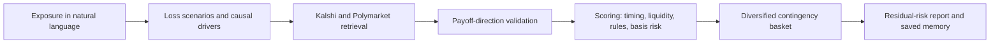

# Riskoff MCP

Riskoff is a read-only MCP server that turns a business or financial exposure into an explainable contingency basket of live prediction-market contracts. It helps an AI client assess whether a contract may pay in a scenario where the user loses money; it does not execute trades or promise insurance.

Any MCP-capable product can use it to:

- semantically search active Kalshi and Polymarket markets through one normalized interface;
- recall relevant user context from MemPalace (with a local profile fallback);
- surface explainable hedge candidates for an exposure such as “I invest in nuclear—how can I hedge?”;
- remember explicit preferences and corrections; and
- simulate YES/NO trades in a local paper portfolio.

## Risk-offset workflow



The core rule is: **a related market is not automatically a hedge.** Counterweight only accepts a candidate when its YES or NO side can be defended as paying in a defined loss scenario. Everything else is rejected or labelled as a high-basis-risk proxy.

No code path places real-money orders. This is a research and hackathon prototype, not financial advice.

## Install the macOS app

Download `Riskoff.dmg`, open it, and drag Riskoff into Applications. Opening
Riskoff starts both the local dashboard and the MCP server. Closing the window
on macOS leaves the app and server running; choose **Riskoff > Quit Riskoff** to
stop both.

The app includes the UI, MCP runtime, market integrations, paper ledger, and the
vendored MemPalace source. On first launch it prepares MemPalace in Riskoff's
private Application Support folder when Python 3 is available. The readable
local profile fallback remains available while that one-time background setup
finishes. Node.js is not required by the packaged app.

Inside Riskoff, open **Connections** and copy the local MCP endpoint. Add that
HTTP endpoint to any local MCP-capable client and keep Riskoff open. Claude's
cloud connector still requires the HTTPS tunnel described below because it
cannot call a Mac's loopback address.

## Developer launch

On macOS, double-click **`Start Riskoff.command`** in Finder. The
launcher installs the Node dependencies, creates an isolated `.venv`, attempts
to install the bundled MemPalace source, builds the MCP, starts it at
`http://127.0.0.1:3000/mcp`, and opens a local status page. The first launch is
slower because MemPalace and its vector-database dependencies may be installed;
later launches reuse the environment. If that optional installation fails, the
server starts with its local profile-memory fallback.

From a terminal on macOS or Linux, the same path is:

```bash
npm run local
```

Keep the launcher terminal open while using the MCP. Press Control-C to stop it.

### Connect to Claude

Claude's custom connector form cannot use `http://127.0.0.1` because connector
requests originate from Anthropic's cloud and require a public HTTPS endpoint.
On macOS, double-click **`Connect Riskoff to Claude.command`** instead. It starts the local
MCP plus a temporary Cloudflare Quick Tunnel, copies the generated HTTPS MCP URL
to your clipboard, and opens Claude's connector settings. Paste that URL into
**Settings > Connectors > Add custom connector** and leave both OAuth fields
blank.

The generated `trycloudflare.com` address is temporary and changes when the
launcher restarts. This is suitable for local development and paper trading,
not a production deployment. Anyone who obtains the temporary URL can reach the
connector while the launcher is running, so do not put sensitive memories into
this development tunnel.

## Architecture

```text
MCP client / website backend
          |
   stdio or Streamable HTTP
          |
  Riskoff MCP
   |        |         |
Kalshi  Polymarket  User context
 REST    Gamma API  Vendored MemPalace + local profile
          |
   Semantic ranker
 (OpenAI embeddings or local concept-aware BM25)
          |
    Local paper ledger
```

The MCP client remains responsible for natural-language conversation. The server returns structured market evidence and does not pretend that market relevance proves a valid hedge: users must verify correlation, contract rules, liquidity, and maximum loss.

## Setup

Requires Node.js 20 or newer.

```bash
npm install
cp .env.example .env
npm run check
```

Environment files are not loaded automatically. Export the values in your process manager or shell when needed.

### Local MCP over stdio

Build first, then configure an MCP host to run:

```json
{
  "mcpServers": {
    "riskoff": {
      "command": "node",
      "args": ["/absolute/path/to/Riskoff/dist/src/index.js"],
      "env": {
        "DATA_DIR": "/absolute/path/to/Riskoff/data"
      }
    }
  }
}
```

For development, `npm run dev` starts the stdio transport directly.

### Remote/web integration

Browsers generally should connect through the website's authenticated backend. Start stateless Streamable HTTP mode with:

```bash
MCP_TRANSPORT=http \
ALLOWED_ORIGINS=https://your-app.example \
MCP_API_TOKEN=replace-me \
npm run dev:http
```

The MCP endpoint is `POST http://127.0.0.1:3000/mcp`; health is at `/health`. Set `HOST=0.0.0.0` only behind TLS and an authenticated reverse proxy. `MCP_API_TOKEN` is strongly recommended outside localhost.

## Tools

- `analyze_exposure` — saves a structured exposure, loss scenarios, risk channels, budget, and target coverage.
- `find_risk_offsets` — retrieves live markets through the existing connectors and returns accepted and rejected candidates with payoff-direction checks.
- `build_contingency_basket` — selects nonredundant accepted candidates while respecting budget and basis-risk limits.
- `explain_residual_risk` — reports uncovered scenarios, timing, liquidity, settlement, and proxy-risk limitations.
- `search_prediction_markets` — unified natural-language market search.
- `recall_user_context` — relevant MemPalace and local profile memories.
- `remember_user_context` — stores a fact the user explicitly wants remembered.
- `recommend_hedges` — combines exposure, recalled context, and live markets.
- `get_paper_portfolio` — cash, positions, and simulated trade history.
- `get_trade_performance` — current marks, profit/loss, equity, and saved performance history.
- `scan_political_risk` — current source-linked web reporting with exposure-aware explanations.
- `execute_paper_trade` — confirmed paper-only buy/sell at the displayed price.

## Dashboard and proactive monitoring

The local dashboard shows cash, marked equity, open-position profit/loss,
performance snapshots, and every simulated fill. Selecting a position explains
the binary payoff and links to the contract rules.

While the desktop app is running, Riskoff scans the most recent explicit profile
facts every 15 minutes. It searches GDELT with a Google News RSS fallback,
deduplicates source links, labels escalation language, and explains the overlap
with the monitored exposure. New alerts can trigger a macOS notification. Riskoff
does not trade from news automatically; it presents evidence for review and all
execution remains confirmed paper trading.

Build a local Apple Silicon DMG with:

```bash
npm run dmg
```

The artifact is written to `dist/Riskoff-<version>-arm64.dmg`. Public releases
should be signed with a valid Developer ID certificate and notarized before
distribution.

Every tool takes a `user_id` where identity matters. A production deployment must derive this from authenticated server-side identity rather than trusting a browser-supplied value.

## Demo walkthrough

1. Call `analyze_exposure` with `user_id: "demo-importer"` and:

   ```text
   I operate a small electronics-import business. During the next six months I could lose around $100,000 if tariffs rise, shipping costs spike, or consumer demand falls. My hedge budget is $10,000 and I want to cover about half of the downside.
   ```

2. Pass the returned `exposure.id` to `find_risk_offsets`.
3. Point out an accepted candidate's `recommendedSide`, score components, settlement details, and basis-risk explanation. Point out a rejected candidate to show the direction filter.
4. Call `build_contingency_basket` with the same `exposure_id`, a `$10,000` maximum budget, and five maximum contracts.
5. Call `explain_residual_risk` to show what is still unprotected.
6. Ask the MCP client to recall `demo-importer`'s saved exposure in a later request. Structured exposure data is persisted in the existing local profile fallback, and explicit facts continue to be mirrored to MemPalace when available.

## Scoring and limits

Candidates receive a transparent 0-100 score: 25 payoff-direction alignment, 20 causal strength, 15 timing, 10 liquidity, 10 settlement clarity, 10 geography, and 10 protection efficiency, then penalties for basis risk, stale data, and wide spreads. The basket intentionally returns fewer than three contracts when the available markets do not meet these checks.

For a truly direct binary event match only, sizing may use the illustrative estimate `shares = (target coverage * estimated loss) / (1 - contract price)`. It is constrained by budget and is not applied to proxy contracts.

## Semantic search

With `OPENAI_API_KEY`, search uses `text-embedding-3-small` by default. Without it, the service uses a deterministic local ranker with finance-domain concept expansion. Polymarket retrieval uses its query-aware public search endpoint, while Kalshi markets are scanned across paginated active results. A lexical relevance gate applies in both modes: unrelated high-liquidity contracts are rejected, and `recommend_hedges` returns `no_defensible_market_hedge_found` instead of inventing a trade when nothing qualifies. Indirect candidates include an explicit basis-risk warning. Provider failures are returned alongside successful results so one exchange being unavailable does not erase the other exchange's markets.

## MemPalace

The complete MIT-licensed MemPalace `v3.5.0` source is pinned under
`vendor/mempalace` and installed into the project's isolated `.venv` by the
launcher. No global package is required. Each user's memories are stored in a
separate MemPalace wing and semantic reads are scoped to that wing. Explicit
facts are also mirrored to `data/users/<user>/profile.json` as a readable local
fallback. Runtime palace data defaults to `.local/mempalace/palace`; set
`MEMPALACE_PATH` to override it. Attribution and the pinned commit are recorded
in `THIRD_PARTY_NOTICES.md`, while the upstream license remains at
`vendor/mempalace/LICENSE`.

## Data and safety boundaries

- Paper ledgers and local profiles are ignored by Git and stored beneath `DATA_DIR`.
- There are no Kalshi keys, wallet keys, Polymarket credentials, or real-order adapters.
- Paper fills use the latest displayed market price and do not model spread, slippage, fees, partial fills, or settlement.
- Before production: add real authentication/authorization, encrypted storage, rate limiting, audit logs, price freshness checks, settlement reconciliation, privacy controls, and legal/compliance review.

Market discovery uses Kalshi's public REST API and Polymarket's public Gamma API. The implementation intentionally does not use authenticated trading endpoints.
