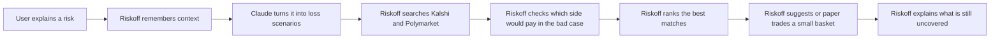

# Riskoff MCP

Riskoff is an MCP server and local app that helps Claude understand who you are, what you care about, and what real-world risks you want to protect. It finds prediction-market ideas that may help offset that risk and can paper trade them for you.

It is proactive. It remembers context. It watches for risk. It does not place real-money trades.

## Risk-offset workflow



## Simple example

Think of a Knicks bar.

- If the Knicks win, the bar may have to give away free drinks.
- Riskoff looks for a market that pays if the Knicks win.
- That payout can help cover some of the drink cost.
- If the market does not really match the business risk, Riskoff rejects it.

That is the main idea: find a market that helps when the business loses.

## Very simple flow

1. The user says what could go wrong.
2. Riskoff remembers the user and the exposure.
3. Riskoff searches Kalshi and Polymarket.
4. Riskoff checks `YES` and `NO` to see which side helps in the bad case.
5. Riskoff shows the best few options.
6. Riskoff can paper trade the hedge and keep monitoring it.
7. Riskoff explains what risk is still left.

## Main tools

- `analyze_exposure` - turn plain English into a structured risk.
- `find_risk_offsets` - search live markets and reject the wrong ones.
- `build_contingency_basket` - pick a small set of useful markets.
- `explain_residual_risk` - show what is still not covered.

## Run it

```bash
npm install
npm run local
```

For development:

```bash
npm run dev
```

### macOS app

Download [Riskoff 0.2.4](https://10ziaimfkeiidwza.public.blob.vercel-storage.com/downloads/Riskoff-0.2.4-arm64.dmg), drag it to Applications, and open it. The dashboard and MCP server run together.

## Paper execution modes

Riskoff never submits production or real-money orders.

| Platform | Paper execution | Where it appears |
| --- | --- | --- |
| Kalshi | Official Kalshi Demo API using mock funds | Riskoff and the connected account at `demo.kalshi.co` |
| Polymarket | Local Riskoff simulation marked to live public market data | Riskoff only |

To connect Kalshi Demo, create a separate demo account and API key at [demo.kalshi.co](https://demo.kalshi.co/). In Riskoff, open **Connections**, enter the Demo API key ID and RSA private key, and click **Connect Kalshi Demo**. Riskoff verifies the credentials against the official Demo balance endpoint before saving them locally with owner-only file permissions. Production Kalshi credentials are not accepted because all requests use the Demo API host.

Polymarket has no paper environment in its documented CLOB API. Riskoff therefore keeps Polymarket positions local and labels them **Local simulation**. Polymarket wallet keys and production order credentials are not accepted or stored.

## Examples

Example 1: Individual trader

- "I just bought $15,000 worth of NVIDIA stock because I think AI demand will stay strong. What prediction markets could help offset my downside if I'm wrong?"
- Possible Kalshi offset, as a simple proxy: [Fed funds rate after July meeting?](https://kalshi.com/markets/KXFED)

Example 2: Crypto investor

- "I have most of my portfolio in Bitcoin. I'm worried new U.S. crypto regulation could hurt the market. Find me some risk-offset opportunities."
- Possible Kalshi offset, as a simple proxy: [CPI in June Odds & Predictions 2026](https://kalshi.com/markets/KXCPI)

Example 3: Everyday investor

- "I just invested most of my savings in an S&P 500 ETF. I'm worried a recession could hit before the end of the year. What prediction markets could help reduce that risk?"
- Possible Kalshi offset, and the closest direct match here: [Recession this year?](https://kalshi.com/markets/KXRECSSNBER)

## Key message

Riskoff helps when a business or portfolio goes wrong and you want a market that pays in that same bad case.
